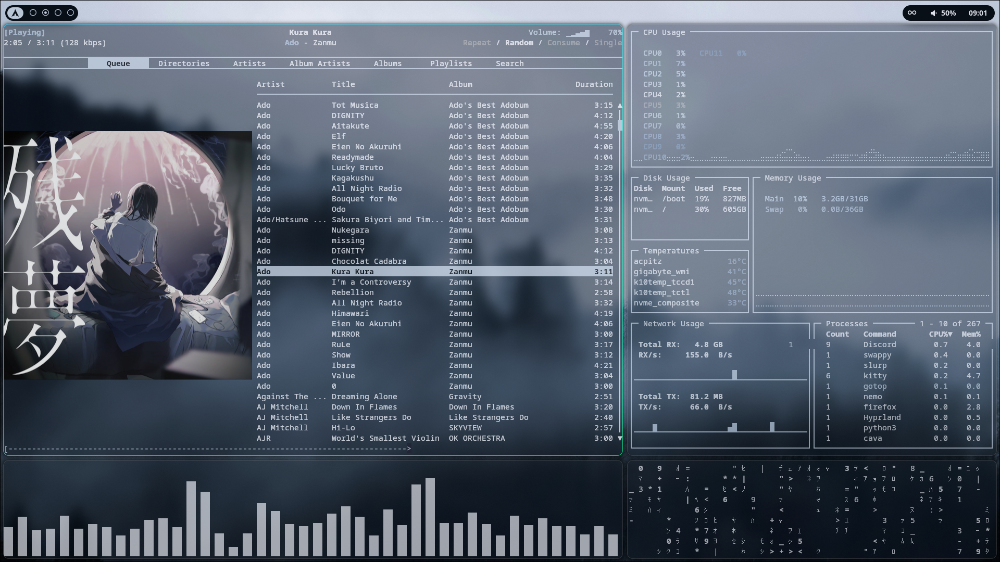
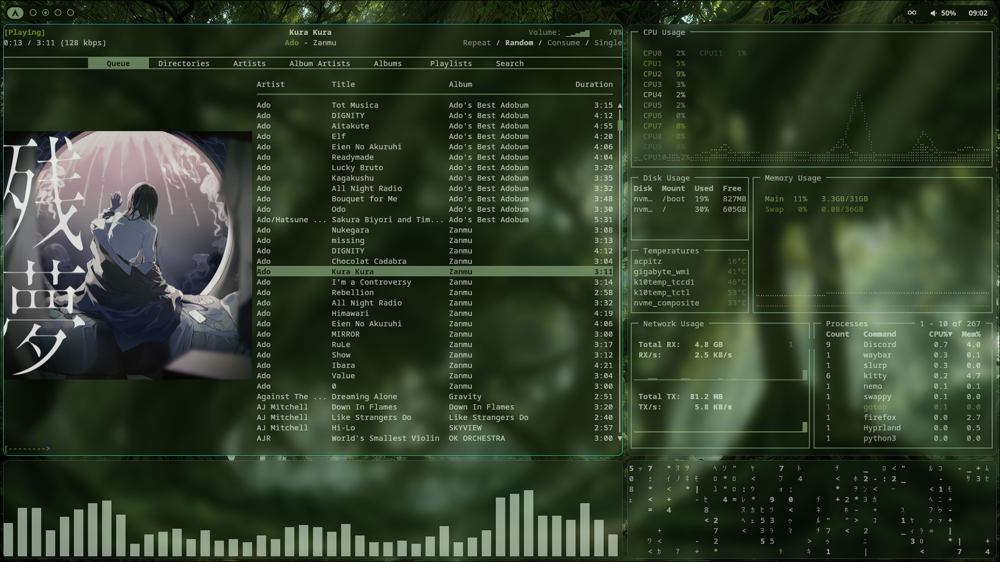
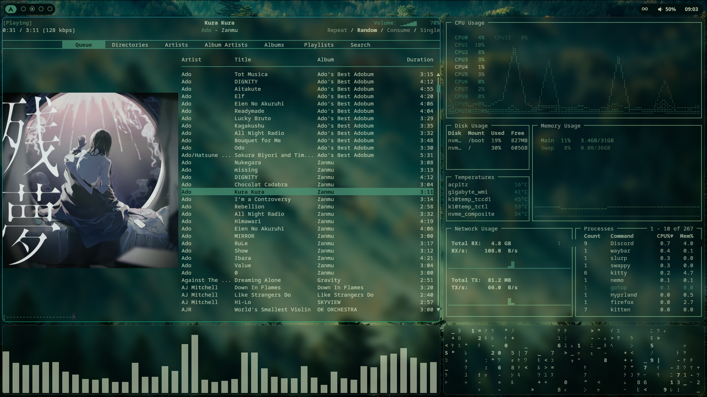
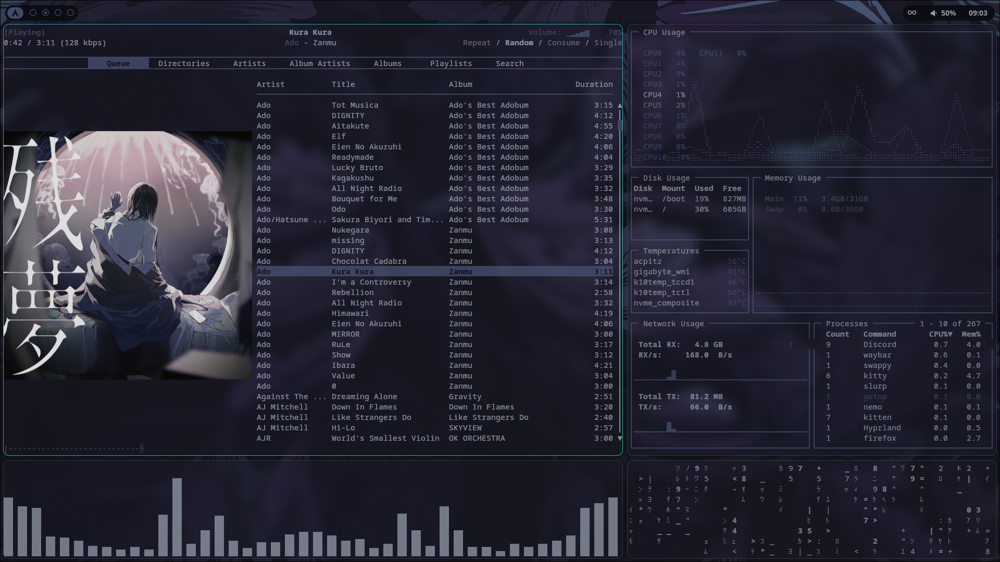
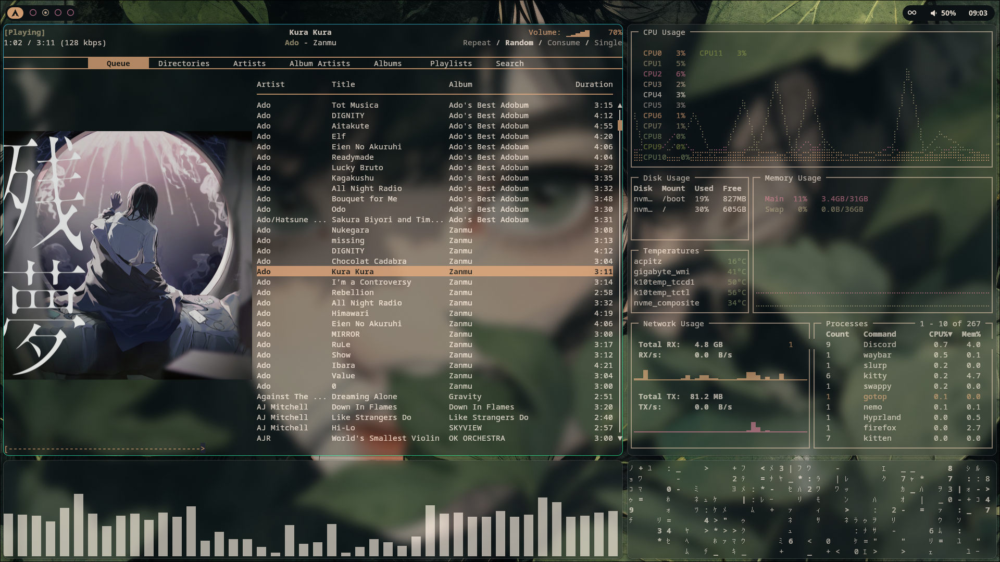
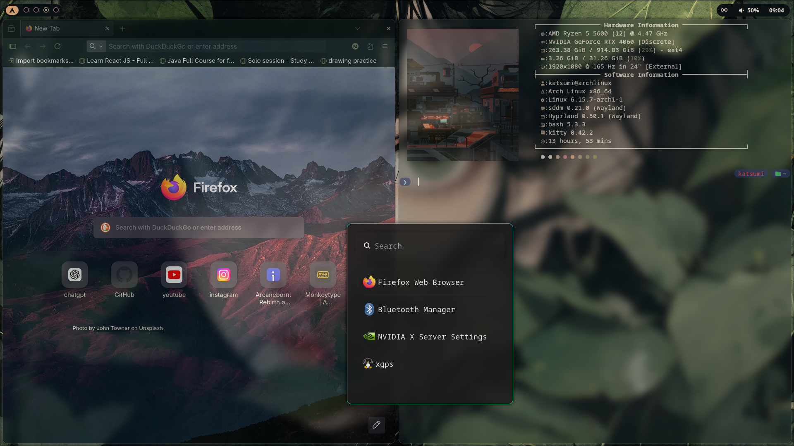
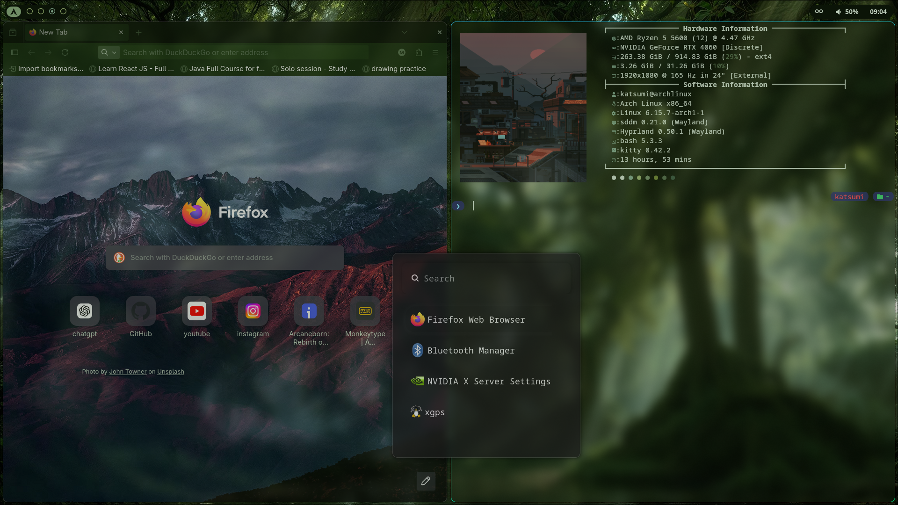
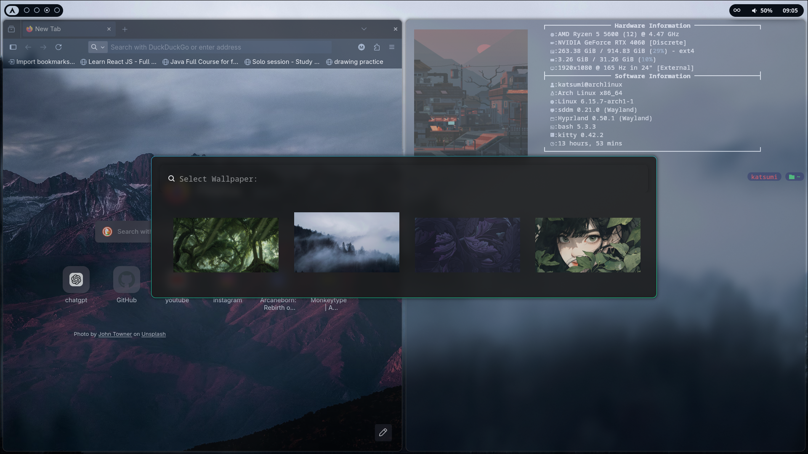

# Manjit's Dotfiles

This is the edited version of my Dotfiles for Arch in Hyprland. I am relatively new to ricing, so while my rice is no where near perfect, it gets the job done. I am putting a lot of effort into it and am still slowly working on it. This rice is inspired by **[elifouts](https://github.com/elifouts/Dotfiles/tree/main)** which looks awesome so check them out.
I hope you enjoy my rice.

  
  

  
  

  
  

  
  

# Details

- OS: Arch Linux
- DE: Hyprland
- Terminal: Kitty
- Music Player: mpd, rmpc
- Audio Visualizer: cava
- Shell: bash
- Bar: Waybar
- App Launcher: wofi
- Editor: Neovim
- File Manager: nemo
- Fetch: fastfetch
- Browser: firefox
