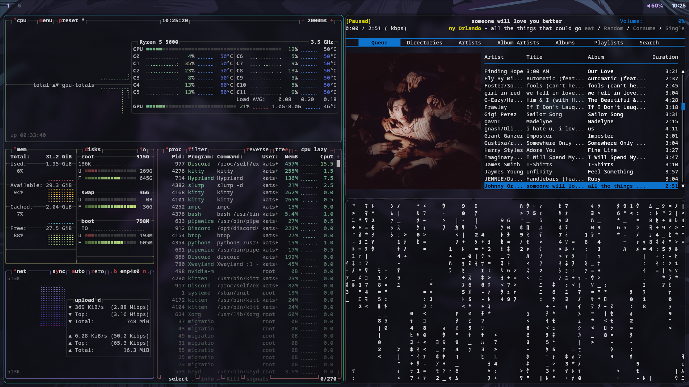
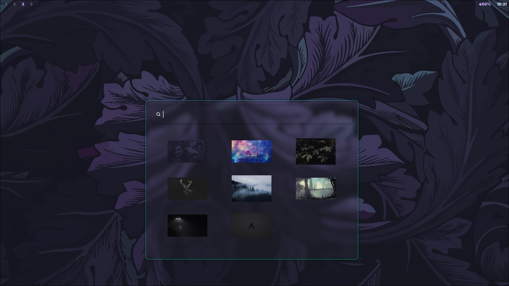

# Manjit's Dotfiles

My Dotfiles for Arch in Hyprland. I am relatively new to ricing, so while my rice is no where near perfect, it gets the job done. I am putting a lot of effort into it and am still slowly working on it. This rice is inspired by many other people's work that i find are awesome, regrettably I can't mention everyone by name.

I hope you enjoy it.

Also please note that the install script is aimed towards FRESH installs only and is still experimental so if you already have a pre existing rice set-up then back it up and please please please be careful while using the install script. Thank you! 

  
  

  
  

  
  

# Details

- OS: Arch Linux
- DE: Hyprland
- Terminal: Kitty
- Music Player: mpd, rmpc
- Shell: bash
- Bar: Waybar
- App Launcher: wofi
- Editor: Neovim, code
- File Manager: Nautilus, Dolphin
- Fetch: fastfetch
- Browser: firefox, chromium

The ricing is still in process and I do plan to do everything from scratch later when i have time and am motivated to work everything from the ground up and connect them together to make a seamless environment to work on. If you do end up using this rice. Thank you so much for using it.
